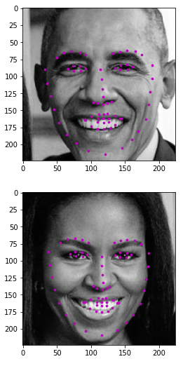

# Facial-Keypoint-Detection

First Project of Computer Vision Nanodegree by Udacity - **Detection of Facial Keypoints**

The Project has been reviewed by Udacity and graded Meets Specifications against the
following rubric. https://github.com/udacity/P1_Facial_Keypoints/blob/master/README.md

Tried several models and experimented with the number of layers, loss functions and hyperparameters, to finally settle on a 5 Conv layered network.
 Sample output:

